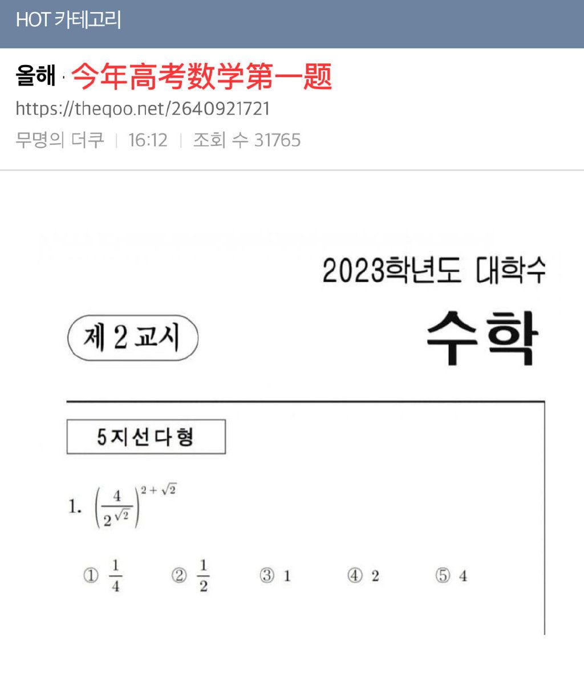
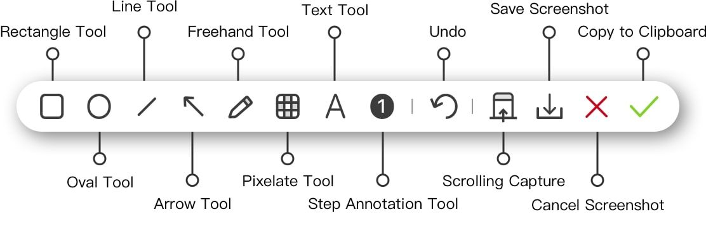
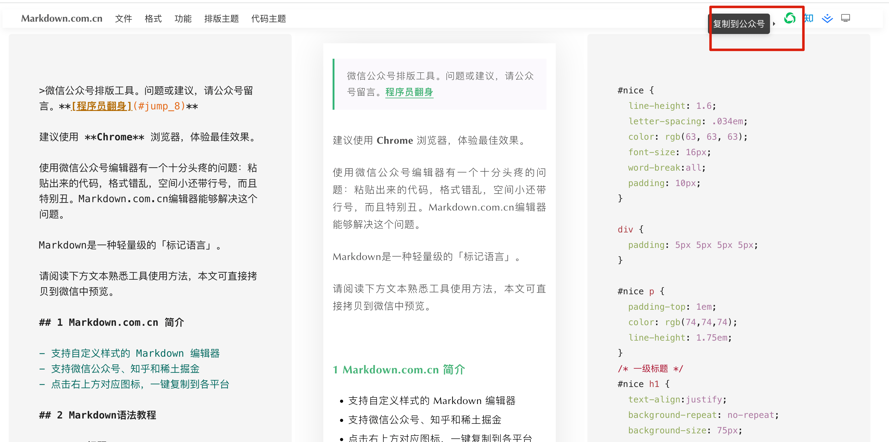
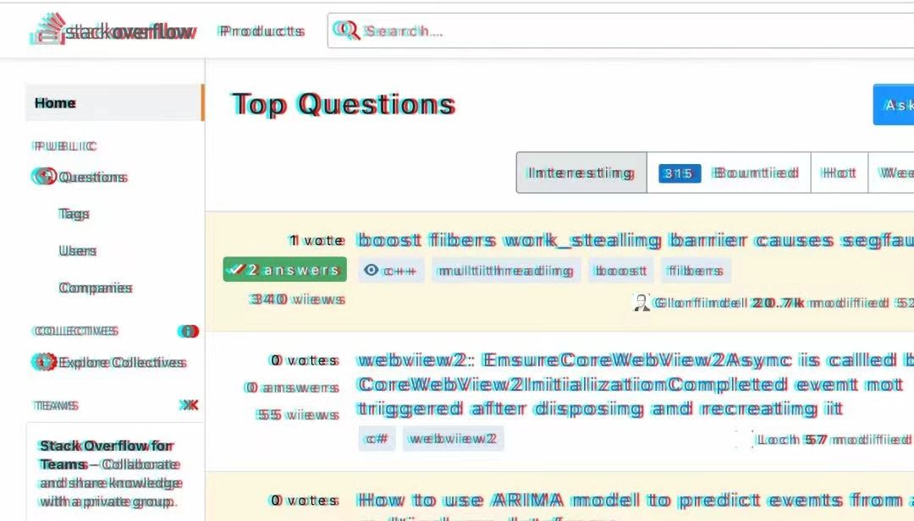
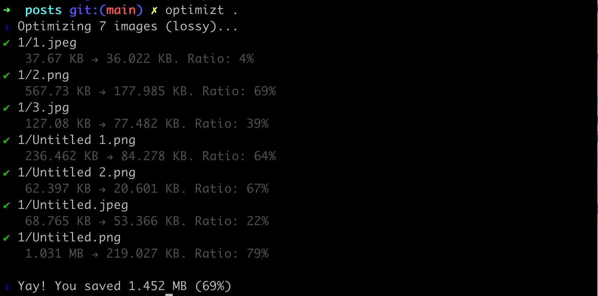

# Landon’s #1：

**1）韩国高考数学[第一题](https://s.weibo.com/weibo?q=%E9%9F%A9%E5%9B%BD%E4%BB%8A%E5%A4%A9%E9%AB%98%E8%80%83%E6%95%B0%E5%AD%A6%E7%AC%AC%E4%B8%80%E9%81%93%E9%A2%98 "韩国2022高考数学第一题")。**

解答起来非常简单，把 4 看作是 $2^2$，得到 $(2^{2-\sqrt{2}})^{(2 + \sqrt{2})} = 2^{2} = 4$。

**2）2 亿像素的手机-[Redmi Note 12 Pro+](https://www.mi.com/redminote12pro-plus "Redmi. Note 12 Pro+")**

配置参数信息：

- 2 亿像素 超清影像
- 处理器：天玑 1080
- OLED 直屏
- **120W + 5000mAh**（探索版 210W 快充）

**3）Mac 下免费的好用剪切板工具：[Clip](https://clipy-app.com/ "Clip")**

还是一个开源项目 [github.com/Clipy/Clipy](https://github.com/Clipy/Clipy "开源项目 Clip")。

Mac 下一款我喜欢的截图工具 Xnip。

**4）facebook 开源的源码控制工具 [Sapling](https://github.com/facebook/sapling "开源项目 Snapling")**

它和 git 存在如下差别：

- Sapling 不需要或鼓励使用命名的本地分支；
- 没有 staging area；
- clone/push 时，不会下载所有的仓库数据；
- 对回退撤销的支持更好（类似 git 的 checkout/reset/reflog）；
- 不使用 rebase；
- Sapling 通常每个命令做一件事；
- Sapling 跟踪了更多 commit 历史等等。

**5）[「得意黑」](https://github.com/atelier-anchor/smiley-sans "得意黑字体")一款在人文观感和几何特征中寻找平衡的中文黑体。**

**6）写微信公众号的排版工具：[Markdown 在线编辑器](https://markdown.com.cn/editor/ "Markdown editor")。**

在本地的编辑器使用 Markdown 语法编写完成后，打开网站，导入 `.md` 文件，选择排版样式，可以自定义 css style。

**7）stackoverflow 的[瞎眼模式](https://zhuanlan.zhihu.com/p/491644275 "Stackoverflow")**

**8）[funbox/optimizt](https://github.com/funbox/optimizt "命令行图片压缩工具")**

Optimizt 是一种 CLI（Command-Line Interpreter）工具，可以压缩 PNG，JPEG，GIF 和 SVG 图像，使用非常方便。

